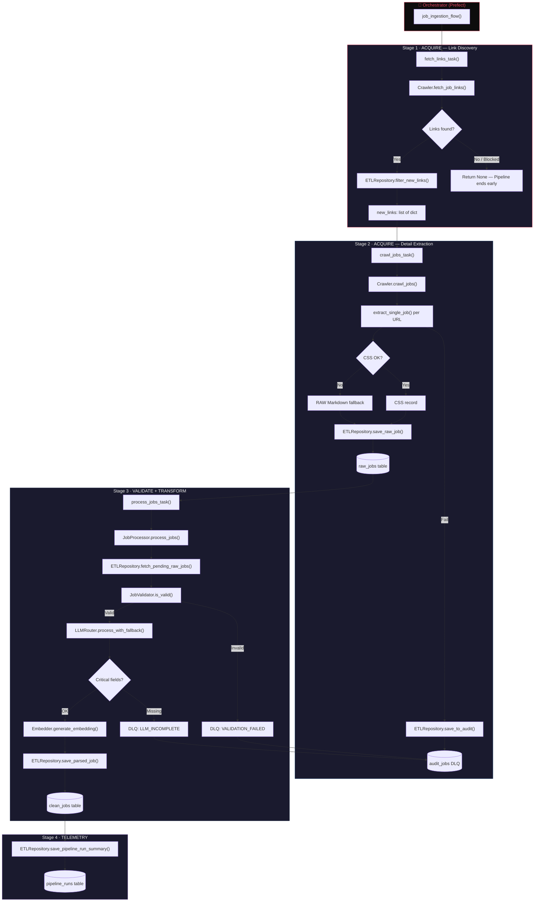

# InternHunter: ETL Pipeline Map

> **Purpose:** A single-source-of-truth reference for auditing every stage of the data pipeline.
> Each section maps **Stage → Files → Functions → Data Shape → DB Destination → Error Path**.
> Cross-reference with the [MVP Plan](./mvp_plan.md) to verify coverage.

---

## Pipeline Overview (Mermaid)



---

## Stage 1 · ACQUIRE — Link Discovery

> **Goal:** Scrape the TopCV search page, extract job URLs, and filter out duplicates already in the DB.

| Aspect | Detail |
|---|---|
| **Prefect Task** | `fetch_links_task()` — retries 3×, 60s delay |
| **Entry Function** | `Crawler.fetch_job_links(run_id)` |
| **Source URL** | `settings.DS_URL` → `https://www.topcv.vn/tim-viec-lam-data-scientist?sba=1` |
| **Extraction Strategy** | `JsonCssExtractionStrategy` with selector `.job-item-search-result` → `h3.title a[href]` |
| **Anti-Bot** | Random 2-4s sleep before request, `user_agent_mode="random"` |

### Files Involved

| File | Key Functions | Role |
|---|---|---|
| [ingestion_flow.py](file:///d:/Data_Science_Project/job_finder/src/flows/ingestion_flow.py) | `fetch_links_task()` | Prefect task wrapper |
| [crawl.py](file:///d:/Data_Science_Project/job_finder/src/services/crawler/crawl.py#L60-L116) | `Crawler.fetch_job_links()` | Core logic: crawl → parse → dedup |
| [crawl_config.py](file:///d:/Data_Science_Project/job_finder/src/services/crawler/crawl_config.py#L11-L29) | `fetch_link_schema`, `fetch_link_run_config` | CSS selectors & crawl4ai config |
| [etl.py](file:///d:/Data_Science_Project/job_finder/src/infrastructure/db/repositories/etl.py#L62-L92) | `ETLRepository.filter_new_links()` | DB deduplication against `raw_jobs.url` |

### Data Shape (Output)

```python
# new_links: list[dict]
[
    {"url": "https://www.topcv.vn/...", "scraped_at": "2026-05-12T...", "source": "topcv"},
    ...
]
```

### Error Paths

| Condition | Handling |
|---|---|
| Captcha / "Verify you are human" | Detected in `result.html` → returns `None` → pipeline ends |
| Network failure | `_arun_with_retry()` → `tenacity` 3 attempts, exponential backoff (4-60s) |
| No new links | Logs `no_new_jobs` → returns `None` → pipeline ends |

---

## Stage 2 · ACQUIRE — Detail Extraction

> **Goal:** For each new URL, scrape the full job page and save the raw data. Uses a two-tiered extraction strategy: CSS first, RAW markdown fallback.

| Aspect | Detail |
|---|---|
| **Prefect Task** | `crawl_jobs_task()` — retries 2×, 300s delay |
| **Entry Function** | `Crawler.crawl_jobs(new_links, run_id)` |
| **Per-Job Function** | `Crawler.extract_single_job(crawler, url)` |
| **Anti-Bot** | Random 10-15s delay per job, `UndetectedAdapter`, `magic=True`, `simulate_user=True` |
| **DB Write** | `ETLRepository.save_raw_job()` → `raw_jobs` table |

### Files Involved

| File | Key Functions | Role |
|---|---|---|
| [ingestion_flow.py](file:///d:/Data_Science_Project/job_finder/src/flows/ingestion_flow.py#L18-L25) | `crawl_jobs_task()` | Prefect task wrapper |
| [crawl.py](file:///d:/Data_Science_Project/job_finder/src/services/crawler/crawl.py#L118-L297) | `extract_single_job()`, `crawl_jobs()` | Two-tier extraction + save loop |
| [crawl_config.py](file:///d:/Data_Science_Project/job_finder/src/services/crawler/crawl_config.py#L32-L123) | `extract_detail_schema`, `extract_detail_run_config` | Multi-selector CSS schema for title, company, salary, location, experience, info |
| [etl.py](file:///d:/Data_Science_Project/job_finder/src/infrastructure/db/repositories/etl.py#L94-L138) | `save_raw_job()`, `save_to_audit()` | Persist to `raw_jobs` or DLQ |
| [models.py](file:///d:/Data_Science_Project/job_finder/src/infrastructure/db/models.py#L10-L29) | `RawJobDB` | SQLAlchemy ORM model |

### Extraction Decision Tree

```
extract_single_job(url)
├── crawl4ai.arun(url, config) with retry
│
├── CSS Extraction (result.extracted_content)
│   ├── Parse JSON → data[0]
│   ├── Check: data.title exists AND data.info length > 200
│   │   ├── ✅ PASS → extraction_method = "css", status = "pending"
│   │   └── ❌ FAIL → Fall through to RAW
│
└── RAW Fallback (result.markdown_v2.raw_markdown)
    ├── Check for bot-blocking signals in HTML
    ├── extraction_method = "raw"
    └── status = "blocked" if captcha detected, else "pending"
```

### Data Shape (Saved to `raw_jobs`)

```python
# CSS success
{"url": "...", "title": "AI Engineer", "company": "FPT", "location": "Ha Noi",
 "full_json_dump": {...css fields...}, "extraction_method": "css", "status": "pending"}

# RAW fallback
{"url": "...", "title": "Unknown (RAW)", "company": "Unknown (RAW)", "location": "Unknown",
 "raw_markdown": "...full page markdown...", "extraction_method": "raw", "status": "pending|blocked"}
```

### DB Table: `raw_jobs`

| Column | Type | Notes |
|---|---|---|
| `id` | Serial PK | Auto-increment |
| `url` | String (unique) | Canonical URL (no query/fragment) |
| `title` | String | From CSS or "Unknown (RAW)" |
| `company` | String | From CSS or "Unknown (RAW)" |
| `location` | String | From CSS or "Unknown" |
| `full_json_dump` | JSON | Complete CSS extraction result |
| `raw_markdown` | Text | Only populated for RAW fallback |
| `status` | String | `pending` → `completed` / `failed` |
| `extraction_method` | String | `css` or `raw` |
| `retry_count` | Integer | Tracks processing retries |
| `created_at` | DateTime | Auto-set |

### Error Paths

| Condition | Handling | DLQ Entry |
|---|---|---|
| `result.success = False` | `extract_single_job()` returns `None` | `CRAWL_FAILED` → `audit_jobs` |
| Bot/captcha detected in RAW | Saved with `status="blocked"` | `BOT_DETECTED` → `audit_jobs` + screenshot |
| DB save fails (IntegrityError) | Logs duplicate, returns `False` | — |

---

## Stage 3 · VALIDATE + TRANSFORM + LOAD

> **Goal:** Fetch `pending` raw jobs, validate them, transform via LLM into structured schema, generate embeddings, and write to `clean_jobs`.

| Aspect | Detail |
|---|---|
| **Prefect Task** | `process_jobs_task(limit)` — no retries |
| **Entry Function** | `JobProcessor.process_jobs(limit)` |
| **Fetch** | `ETLRepository.fetch_pending_raw_jobs(limit)` → `WHERE status = 'pending'` |
| **Rate Limiting** | `60 / rate_limit_rpm` seconds sleep between jobs |

### Sub-Stage 3a: Validation Guardrail

| Aspect | Detail |
|---|---|
| **Class** | `JobValidator` |
| **Tier 1 (Free)** | Heuristic: `len(text) >= 300` AND `>= 2 job keywords` found |
| **Tier 2 (Cheap)** | LLM-Lite: `gemini-2.0-flash-lite` classifies captcha/expired/non-job pages |
| **Fail Action** | `status = "failed"` + DLQ entry `VALIDATION_FAILED` |

### Sub-Stage 3b: LLM Transformation

| Aspect | Detail |
|---|---|
| **Router** | `LLMRouter.process_with_fallback(job)` |
| **Primary** | `GeminiClient` → `gemini-2.5-flash-lite` (configurable) |
| **Fallback** | `GroqClient` → `llama-3.3-70b-versatile` |
| **Input Prep** | `LLMProvider._prepare_job_context()` → regex splits `info` into description/requirement/benefit |
| **Prompt** | Jinja2 template from `config/prompts.yaml` → `job_processor` key |
| **Output Schema** | `LLMJobProcess` (Pydantic) → forced via `response_schema` (Gemini) or `json_schema` (Groq) |
| **Quality Gate** | Post-parse check: `standardized_title` AND `description` must be non-empty |
| **Fail Action** | `status = "failed"` + DLQ entry `LLM_INCOMPLETE` |

### Sub-Stage 3c: Embedding Generation

| Aspect | Detail |
|---|---|
| **Class** | `Embedder` |
| **Model** | `gemini-embedding-001` (768 dimensions) |
| **Input** | `standardized_title + description + technical_competencies` joined |
| **Translation** | If `langdetect` ≠ English → `LLMRouter.translate_with_fallback()` before embedding |
| **Retry** | `tenacity` 3 attempts, exponential backoff |
| **Fail Action** | Warning logged, embedding = `None` (job still saved without it) |

### Sub-Stage 3d: Load to `clean_jobs`

| Aspect | Detail |
|---|---|
| **Function** | `ETLRepository.save_parsed_job(parsed, raw_job_id, url, embedding)` |
| **Dedup** | Checks `CleanJobDB.raw_job_id` uniqueness before insert |
| **Status Update** | `raw_jobs.status` set to `completed` on success, `failed` on error |

### Files Involved

| File | Key Functions | Role |
|---|---|---|
| [ingestion_flow.py](file:///d:/Data_Science_Project/job_finder/src/flows/ingestion_flow.py#L27-L31) | `process_jobs_task()` | Prefect task wrapper |
| [job_processor.py](file:///d:/Data_Science_Project/job_finder/src/services/job_processor/job_processor.py) | `JobProcessor.process_jobs()` | Main loop: validate → transform → embed → save |
| [validator.py](file:///d:/Data_Science_Project/job_finder/src/services/job_processor/validator.py) | `JobValidator.is_valid()` | Heuristic + LLM-Lite guard |
| [router.py](file:///d:/Data_Science_Project/job_finder/src/infrastructure/llm/router.py) | `LLMRouter.process_with_fallback()` | Gemini → Groq fallback |
| [providers.py](file:///d:/Data_Science_Project/job_finder/src/infrastructure/llm/providers.py) | `GeminiClient.process_raw_job()`, `GroqClient.process_raw_job()` | LLM API calls with structured output |
| [base.py](file:///d:/Data_Science_Project/job_finder/src/infrastructure/llm/base.py) | `LLMProvider._prepare_job_context()`, `_extract_info()` | Regex parsing of description/requirement/benefit |
| [embedder.py](file:///d:/Data_Science_Project/job_finder/src/services/job_processor/embedder.py) | `Embedder.generate_embedding()` | Gemini embedding + language detection + translation |
| [etl.py](file:///d:/Data_Science_Project/job_finder/src/infrastructure/db/repositories/etl.py#L140-L256) | `fetch_pending_raw_jobs()`, `save_parsed_job()`, `update_job_status()` | DB read/write |
| [job.py](file:///d:/Data_Science_Project/job_finder/src/core/models/job.py) | `RawJob`, `LLMJobProcess`, `ProcessedJob` | Pydantic schemas |
| [prompts.yaml](file:///d:/Data_Science_Project/job_finder/src/config/prompts.yaml#L34-L68) | `job_processor` template | Jinja2 prompt for LLM extraction |

### Data Shape Transformation

```
┌─────────────────────────────────────────────────────────────┐
│ INPUT: RawJob (from raw_jobs WHERE status='pending')        │
│  .url, .title, .company, .location                         │
│  .full_json_dump  ──→ _prepare_job_context() ──→ extracts: │
│       description, requirement, benefit (via regex)         │
│  .raw_markdown    ──→ used for validation text              │
│  .extraction_method ──→ logged for traceability             │
└───────────────────────┬─────────────────────────────────────┘
                        │
                        ▼
┌─────────────────────────────────────────────────────────────┐
│ LLM OUTPUT: LLMJobProcess (Pydantic, forced schema)        │
│  .standardized_title    .job_level    .is_internship        │
│  .cities[]              .experience   .min_gpa              │
│  .salary_min/max        .currency     .is_salary_negotiable │
│  .tech_stack[]          .technical_competencies[]           │
│  .domain_knowledge[]    .english_requirement                │
└───────────────────────┬─────────────────────────────────────┘
                        │ merged with regex-extracted text
                        ▼
┌─────────────────────────────────────────────────────────────┐
│ FINAL: ProcessedJob (extends LLMJobProcess)                 │
│  + .description   + .requirement   + .benefit               │
└───────────────────────┬─────────────────────────────────────┘
                        │ + embedding (768-dim float[])
                        ▼
┌─────────────────────────────────────────────────────────────┐
│ DB: clean_jobs                                              │
│  All ProcessedJob fields + raw_job_id FK + embedding column │
└─────────────────────────────────────────────────────────────┘
```

### DB Table: `clean_jobs`

| Column | Type | Source |
|---|---|---|
| `id` | Serial PK | Auto |
| `raw_job_id` | FK → `raw_jobs.id` (unique) | Linkage |
| `standardized_title` | String (indexed) | LLM |
| `job_level` | String | LLM |
| `is_internship` | Boolean | LLM |
| `description` | Text | Regex from `info` |
| `requirement` | Text | Regex from `info` |
| `benefit` | Text | Regex from `info` |
| `cities` | JSON | LLM |
| `experience` | Float | LLM |
| `min_gpa` | Float | LLM |
| `english_requirement` | String | LLM |
| `salary_min` / `salary_max` | Float | LLM |
| `currency` | String | LLM |
| `is_salary_negotiable` | Boolean | LLM |
| `tech_stack` | JSON | LLM |
| `technical_competencies` | JSON | LLM |
| `domain_knowledge` | JSON | LLM |
| `embedding` | Vector(768) | Embedder |
| `created_at` | DateTime | Auto |

### Error Paths (Stage 3)

| Condition | Status Set | DLQ Error Type |
|---|---|---|
| Heuristic fail (short/no keywords) | `failed` | `VALIDATION_FAILED` |
| LLM-Lite rejects as non-job | `failed` | `VALIDATION_FAILED` |
| LLM parse missing title/description | `failed` | `LLM_INCOMPLETE` |
| Both Gemini + Groq fail | `failed` | `PROCESSING_ERROR` |
| Embedding fails | — (job still saved) | Warning logged only |
| DB save fails | `failed` | — |

---

## Stage 4 · TELEMETRY

> **Goal:** Record a summary of the pipeline run for observability.

| Aspect | Detail |
|---|---|
| **Function** | `ETLRepository.save_pipeline_run_summary()` |
| **Trigger** | End of `job_ingestion_flow()` — always runs, even for 0-job runs |
| **MLflow** | `mlflow.gemini.autolog()` tracks LLM calls in providers |

### DB Table: `pipeline_runs`

| Column | Type | Notes |
|---|---|---|
| `id` | Serial PK | Auto |
| `run_id` | String (unique, indexed) | UUID[:8] generated at flow start |
| `timestamp` | DateTime | Auto |
| `jobs_acquired` | Integer | Count from Stage 1 |
| `jobs_processed` | Integer | Success count from Stage 3 |
| `jobs_failed` | Integer | Fail count from Stage 3 |
| `status` | String | `completed` or `failed` |

### DB Table: `audit_jobs` (Dead Letter Queue)

| Column | Type | Notes |
|---|---|---|
| `id` | Serial PK | Auto |
| `url` | String | The failed URL |
| `error_type` | String | `BOT_DETECTED`, `CRAWL_FAILED`, `VALIDATION_FAILED`, `LLM_INCOMPLETE`, `PROCESSING_ERROR` |
| `error_message` | Text | Human-readable reason |
| `screenshot_path` | String | Path to saved screenshot (blocked pages only) |
| `html_content` | Text | Raw HTML snippet for debugging |
| `created_at` | DateTime | Auto |

---

## Full File Inventory

All files participating in the ETL pipeline, grouped by layer:

### Orchestration Layer
| File | Purpose |
|---|---|
| [ingestion_flow.py](file:///d:/Data_Science_Project/job_finder/src/flows/ingestion_flow.py) | Prefect flow: wires fetch → crawl → process → telemetry |
| [run_pipeline.py](file:///d:/Data_Science_Project/job_finder/src/run_pipeline.py) | CLI entry point |

### Service Layer (Business Logic)
| File | Purpose |
|---|---|
| [crawl.py](file:///d:/Data_Science_Project/job_finder/src/services/crawler/crawl.py) | Web scraping engine (link fetch + detail extraction) |
| [crawl_config.py](file:///d:/Data_Science_Project/job_finder/src/services/crawler/crawl_config.py) | CSS selectors, browser config, crawl4ai settings |
| [job_processor.py](file:///d:/Data_Science_Project/job_finder/src/services/job_processor/job_processor.py) | Main processing loop: validate → LLM → embed → save |
| [validator.py](file:///d:/Data_Science_Project/job_finder/src/services/job_processor/validator.py) | Heuristic + LLM-Lite job validation |
| [embedder.py](file:///d:/Data_Science_Project/job_finder/src/services/job_processor/embedder.py) | Vector embedding generation (Gemini) |

### Infrastructure Layer
| File | Purpose |
|---|---|
| [router.py](file:///d:/Data_Science_Project/job_finder/src/infrastructure/llm/router.py) | LLM fallback router (Gemini → Groq) |
| [providers.py](file:///d:/Data_Science_Project/job_finder/src/infrastructure/llm/providers.py) | Concrete LLM clients (GeminiClient, GroqClient) |
| [base.py](file:///d:/Data_Science_Project/job_finder/src/infrastructure/llm/base.py) | Abstract LLM interface + regex text extraction |
| [prompt_registry.py](file:///d:/Data_Science_Project/job_finder/src/infrastructure/llm/prompt_registry.py) | Prompt loading utilities |
| [etl.py](file:///d:/Data_Science_Project/job_finder/src/infrastructure/db/repositories/etl.py) | All DB operations for the ETL pipeline |
| [models.py](file:///d:/Data_Science_Project/job_finder/src/infrastructure/db/models.py) | SQLAlchemy ORM: RawJobDB, CleanJobDB, AuditJobDB, PipelineRunDB |
| [session.py](file:///d:/Data_Science_Project/job_finder/src/infrastructure/db/session.py) | Connection pooling (SessionLocal, engine) |

### Configuration Layer
| File | Purpose |
|---|---|
| [settings.py](file:///d:/Data_Science_Project/job_finder/src/config/settings.py) | Pydantic Settings: env vars + YAML loader |
| [settings.yaml](file:///d:/Data_Science_Project/job_finder/src/config/settings.yaml) | Runtime config (LLM models, rate limits, MLflow) |
| [prompts.yaml](file:///d:/Data_Science_Project/job_finder/src/config/prompts.yaml) | Jinja2 prompt templates |

### Core Domain Layer
| File | Purpose |
|---|---|
| [job.py](file:///d:/Data_Science_Project/job_finder/src/core/models/job.py) | Pydantic models: `RawJob`, `LLMJobProcess`, `ProcessedJob` |

---

## Audit Checklist

Use this checklist to systematically verify each part of the pipeline against the [MVP Plan](./mvp_plan.md):

### A. Data Ingestion (MVP §2A)
- [ ] Daily cron job scrapes TopCV → verify Prefect schedule deployment in `scripts/deployment.py`
- [ ] LLM-powered extraction → CSS first, RAW fallback, LLM in Stage 3
- [ ] Idempotency → `filter_new_links()` deduplication via `raw_jobs.url` UNIQUE constraint

### B. Storage (MVP §2B)
- [ ] `raw_jobs` table → audit trail for raw HTML ✅
- [ ] `clean_jobs` table → structured fields ✅
- [ ] `job_embeddings` → currently `clean_jobs.embedding` column (not separate table)
- [ ] `user_profiles` → exists in models.py ✅

### C. Agentic Search (MVP §2C)
- [ ] `text_to_sql` tool → implemented in `services/chat/tools.py`
- [ ] `resume_matcher` → needs `semantic_search_jobs` tool using pgvector
- [ ] `resume_uploader` → needs implementation

### D. Verification (MVP §3)
- [ ] Pipeline end-to-end test → `pipeline_runs` table tracks run summaries
- [ ] SQL accuracy test → manual
- [ ] RAG relevance test → not yet implemented (needs Ragas/TruLens)
